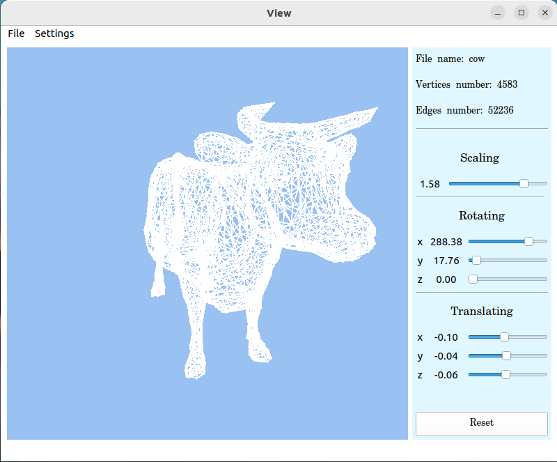

# Implementation of 3DViewer

✔ C++

✔ MVC 

✔ Qt

This project is an implementation of an application for viewing 3D wireframe models in C++ in the object-oriented programming paradigm.

## Interface of the program

We used file `cow.obj` in the example.

